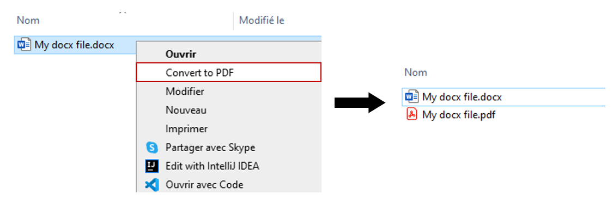

<td><h1>DOCX to PDF converter</h1></td>

This program adds an option to the right-click context menu of any .docx files to convert to PDF on Windows. 
<p align="center">
   

### Prerequisites
* [Python 3](https://www.python.org/ftp/python/3.9.5/python-3.9.5-amd64.exe)
* [Pip](https://pip.pypa.io/en/stable/installing/) 
* winregistry
   ```sh
   pip install winregistry
   ```
* docx2pdf
   ```sh
   pip install docx2pdf
   ```
### Instructions     
1. Clone the repo
   ```sh
   git clone https://github.com/antoinedery/DOCXtoPDFconverter.git
   ```
2. Open terminal in the DOCXtoPDFconverter folder
3. Run CreateRegistryKey.py (this step is required once)
   ```sh
   python CreateRegistryKey.py
   ```
4. Right-click on any .docx file
5. Click on "Convert to PDF"
